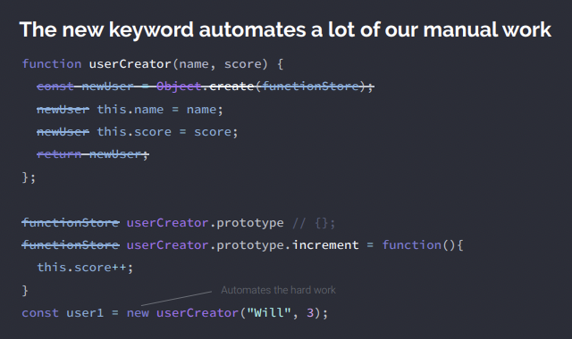

## Prototype Chains
### Concept
```js
function userCreator (name, score) {
    const newUser = Object.create(userFunctionStore);
    newUser.name = name;
    newUser.score = score;
    return newUser;
};
const userFunctionStore = {
    increment: function(){this.score++;},
    login: function(){console.log("Logged in");}
};
const user1 = userCreator("Will", 3);
const user2 = userCreator("Tim", 5);
user1.increment();
```
### Trick Question (this resolution)
```js
function userCreator(name, score) {
    const newUser = Object.create(userFunctionStore);
    newUser.name = name;
    newUser.score = score;
    return newUser;
};
const userFunctionStore = {
    increment: function() {
        function add1(){ this.score++; }
        add1()
    }
};
const user1 = userCreator("Will", 3);
const user2 = userCreator("Tim", 5);
user1.increment(); 
```

### Trick Question (this + arrow functions)
```js
function userCreator(name, score) {
 const newUser = Object.create(userFunctionStore);
 newUser.name = name;
 newUser.score = score;
 return newUser;
};
const userFunctionStore = {
 increment: function() {
 const add1 = () => { this.score++; }
 add1()
 }
};
const user1 = userCreator("Will", 3);
const user2 = userCreator("Tim", 5);
user1.increment();
```

### Shortcut Syntax: new operator
```js
    const newObj = Object.create(protoObject);
    ...
    return newObj;

    // can be simplified to
    const userWill = new userCreator("Will", 3);
```
